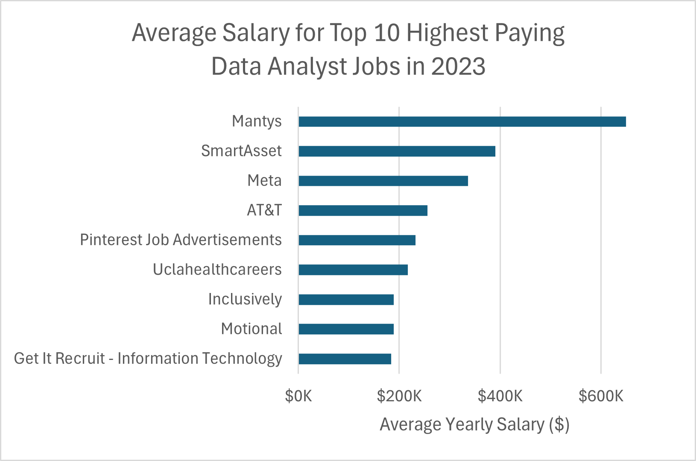
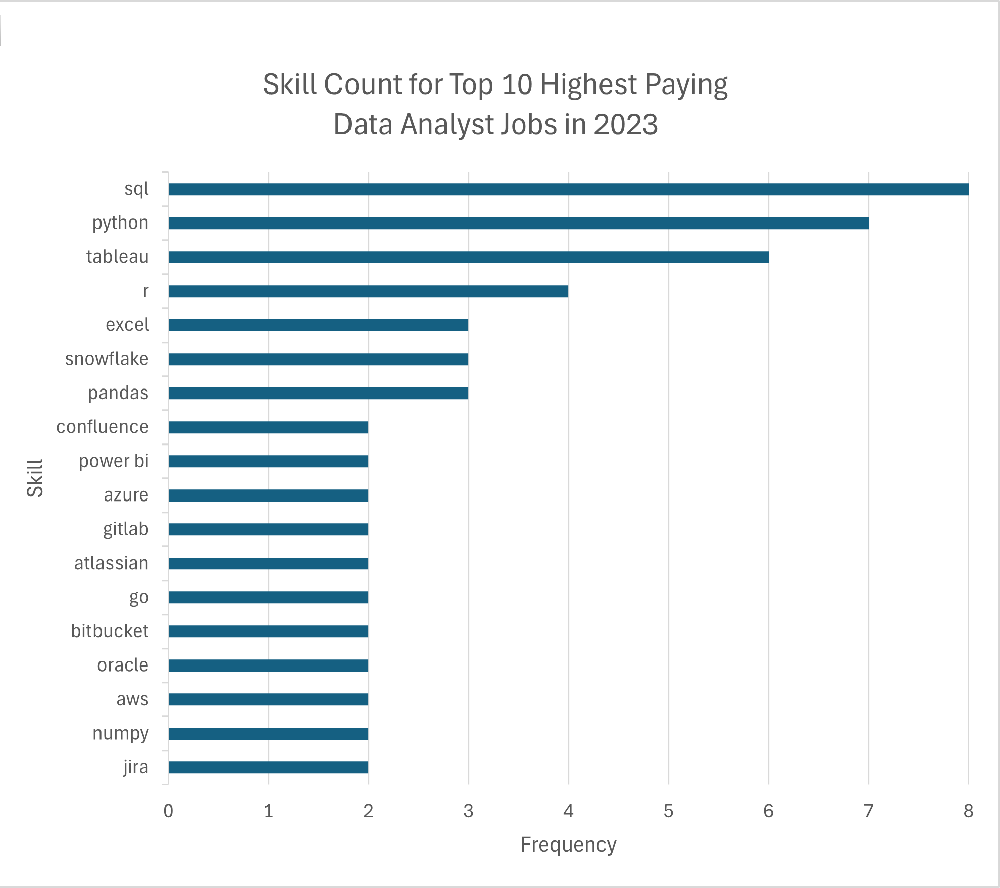

# Introduction

This project uses SQL to analyze job market data for remote data analyst roles. The goal is to uncover which skills are in demand, which ones lead to higher pay, and how aspiring analysts can better position themselves in the job market.

From this analysis, you'll gain insights into:
- The highest-paying remote data analyst roles and the companies offering them
- The skills required for high-paying jobs
- The most frequently requested skills in job postings
- The skills with the highest average salaries
- The most strategic skills to learn based on both demand and compensation

Note: The analysis excludes job listings that did not report a yearly salary.

# Background

I chose this project as part of a SQL course taught by Luke Barousse. It was a hands-on way to improve my SQL skills while gaining insights into how to approach my career transition into data analytics.

The dataset was provided by Barousse, who has been collecting data analyst job postings over the past few years. It includes job titles, salaries, locations, and required skills.

These were the key questions I wanted to answer through my SQL analysis:
- What are the top-paying data analyst jobs?
- What skills are required for these top-paying jobs?
- What skills are most in demand for data analysts?
- Which skills are associated with higher salaries?
- What are the most optimal skills to learn?

# Tools I Used

Here are the main tools I used to complete this project:
- **SQL:** The core language used to query the dataset and uncover insights.  
- **PostgreSQL:** The database management system that stored the dataset and executed my queries.  
- **Visual Studio Code:** My primary environment for writing SQL code, connected to PostgreSQL through an extension.  
- **Git & GitHub:** Used for version control and to share this project as part of my data analytics portfolio.
- **Excel:** Used to visualize query results and create charts for the analysis sections.

# The Analysis

## 1. Top-Paying Remote Data Analyst Jobs

This query identifies the top 10 highest-paying **remote** data analyst roles by filtering for job postings with a non-null yearly salary. It joins the company table to show which companies are offering these roles.

```sql
SELECT
    jpf.job_id,
    jpf.job_title,
    jpf.job_location,
    jpf.job_schedule_type,
    jpf.salary_year_avg,
    jpf.job_posted_date,
    cd.name AS company_name
FROM
    job_postings_fact AS jpf
LEFT JOIN company_dim AS cd
    ON jpf.company_id = cd.company_id
WHERE
    job_title_short = 'Data Analyst'
    AND job_location = 'Anywhere'
    AND salary_year_avg IS NOT NULL
ORDER BY
    salary_year_avg DESC
LIMIT 10;
```

### Insights

- Several of the top-paying roles come from well-known tech companies, such as Meta, AT&T, Pinterest, and SmartAsset.
- The average yearly salary for Mantys stands out at $650,000, likely an outlier, as most other salaries fall between $180,000 to $250,000.
- Job titles include a mix of traditional "Data Analyst" roles and more senior leadership positions like Director of Analytics and Principal Data Analyst, indicating salary scales increase significantly with seniority.



*This chart shows the average yearly salary for the top 10 highest-paying remote data analyst job listings.*

## 2. Skills for Top-Paying Jobs

This query builds on the first one by identifying what skills are required for the top 10 highest-paying remote data analyst roles. It joins the top-paying jobs with the associated skills data to reveal what employers are looking for in these roles.

```sql
WITH top_paying_jobs AS (
    SELECT
        jpf.job_id,
        jpf.job_title,
        jpf.salary_year_avg,
        cd.name AS company_name
    FROM
        job_postings_fact AS jpf
    LEFT JOIN company_dim AS cd
        ON jpf.company_id = cd.company_id
    WHERE
        job_title_short = 'Data Analyst'
        AND job_location = 'Anywhere'
        AND salary_year_avg IS NOT NULL
    ORDER BY
        salary_year_avg DESC
    LIMIT 10
)

SELECT
    tpj.*,
    sd.skills
FROM top_paying_jobs AS tpj
INNER JOIN skills_job_dim AS sjd
    ON tpj.job_id = sjd.job_id
INNER JOIN skills_dim AS sd
    ON sjd.skill_id = sd.skill_id
ORDER BY
    tpj.salary_year_avg DESC;
```

### Insights
- SQL, Python, and Tableau appear most frequently across the top-paying remote data analyst job listings.
- These tools are foundational for data extraction, analysis, and visualization, making them highly sought-after by employers hiring for senior and well-compensated roles.



*This chart shows the frequency of specific technical skills mentioned across the top 10 highest-paying remote data analyst job listings.*

## 3. In-Demand Skills for Data Analysts

This query identifies the top 5 most in-demand skills for remote data analyst roles. It counts how frequently each skill appears in job postings and joins the skills data to display skill names.

```sql
SELECT
    sd.skills,
    COUNT(jpf.job_id) AS demand_count
FROM 
    job_postings_fact AS jpf
INNER JOIN skills_job_dim AS sjd
    ON jpf.job_id = sjd.job_id
INNER JOIN skills_dim AS sd
    ON sjd.skill_id = sd.skill_id
WHERE
    jpf.job_title_short = 'Data Analyst' AND
    jpf.job_work_from_home = true
GROUP BY 
    sd.skills
ORDER BY 
    demand_count DESC
LIMIT 5;
```

### Insights

- SQL dominates the remote data analyst job market, appearing in over 7,000 job listings.
- Excel and Python follow closely, showing that both spreadsheet literacy and programming capabilities remain essential.
- Tableau and Power BI also make the top 5, reinforcing the importance of data visualization tools in analytics workflows.
- These results suggest that foundational skills like SQL and Excel are not just relevant — they're required in the majority of roles, while Python and BI tools offer strong support for more technical or strategic analysis.

| Skill    | Demand Count |
| -------- | ------------ |
| SQL      | 7,291        |
| Excel    | 4,611        |
| Python   | 4,330        |
| Tableau  | 3,745        |
| Power BI | 2,609        |

*This table shows the top 5 most frequently requested skills in remote data analyst job postings.*

## 4. Skills Based on Salary

This query calculates the average salary associated with each skill across remote data analyst job postings. It filters out listings without salary data and returns the top 25 skills sorted by highest average salary.

```sql
SELECT
    sd.skills,
    ROUND(AVG(jpf.salary_year_avg), 0) AS average_salary
FROM 
    job_postings_fact AS jpf
INNER JOIN skills_job_dim AS sjd
    ON jpf.job_id = sjd.job_id
INNER JOIN skills_dim AS sd
    ON sjd.skill_id = sd.skill_id
WHERE
    jpf.job_title_short = 'Data Analyst' AND
    jpf.salary_year_avg IS NOT NULL AND
    jpf.job_work_from_home = true
GROUP BY 
    sd.skills
ORDER BY 
    average_salary DESC
LIMIT 25;
```

### Insights

- The highest-paying skills for remote data analyst roles are often tied to big data, machine learning, and cloud engineering.
- These results suggest that building skills in modern data tooling — especially those related to automation, modeling, and distributed systems — can lead to higher compensation.

| Skill         | Average Salary ($) |
|---------------|--------------------:|
| pyspark       | 208,172             |
| bitbucket     | 189,155             |
| couchbase     | 160,515             |
| watson        | 160,515             |
| datarobot     | 155,486             |
| gitlab        | 154,500             |
| swift         | 153,750             |
| jupyter       | 152,777             |
| pandas        | 151,821             |
| elasticsearch | 145,000             |

*This table shows the top 10 skills associated with the highest average salaries in remote data analyst job postings.*

## 5. Most Optimal Skills to Learn

This query identifies the most optimal skills to learn for remote data analyst roles by combining demand and salary data. It filters out skills that appear in fewer than 10 job postings and sorts the results by average salary and then by demand.

```sql
SELECT
    sd.skill_id,
    sd.skills,
    COUNT(jpf.job_id) AS demand_count,
    ROUND(AVG(jpf.salary_year_avg), 0) AS average_salary
FROM job_postings_fact AS jpf
INNER JOIN skills_job_dim AS sjd
    ON jpf.job_id = sjd.job_id
INNER JOIN skills_dim AS sd
    ON sjd.skill_id = sd.skill_id
WHERE
    jpf.job_title_short = 'Data Analyst' AND
    jpf.salary_year_avg IS NOT NULL AND
    jpf.job_work_from_home = true    
GROUP BY
    sd.skill_id
HAVING
    COUNT(jpf.job_id) > 10
ORDER BY
    average_salary DESC,
    demand_count DESC
LIMIT 25;
```

### Insights

- The most optimal skills for remote data analyst roles tend to be in cloud platforms, data warehousing, and modern analytics tools.
- Several skills like Snowflake, Azure, and AWS appear frequently and are associated with strong average salaries above $100K.
- Skills like Go and BigQuery have high salaries despite lower demand, indicating they may offer value in specialized or niche roles.

| Skill       | Demand Count | Average Salary ($) |
|-------------|---------------|--------------------:|
| go          | 27            | 115,320             |
| confluence  | 11            | 114,210             |
| hadoop      | 22            | 113,193             |
| snowflake   | 37            | 112,948             |
| azure       | 34            | 111,225             |
| bigquery    | 13            | 109,654             |
| aws         | 32            | 108,317             |
| java        | 17            | 106,906             |
| ssis        | 12            | 106,683             |
| jira        | 20            | 104,918             |

*This table shows the top 10 skills that offer the best balance of high demand and high average salary in remote data analyst job postings.*

# What I Learned

Through this project, I strengthened my SQL skills by writing queries with joins, aggregations, and common table expressions (CTEs). I learned how to filter and sort large datasets to answer real-world questions, like identifying in-demand skills and high-paying job opportunities.

This project also helped me think more analytically—breaking down vague questions into specific queries and drawing insights from the results. It was a valuable step in building confidence for real-world data analysis work.

# Conclusions

### Insights Summary

1. **Top-Paying Roles:** The highest-paying remote data analyst jobs reach over $650K, though most fall between $180K–$250K and include senior titles like Director or Principal Analyst.
2. **Skills for Top-Paying Jobs:** SQL, Python, and Tableau appear most frequently among the top-paying roles, indicating they're core to high-compensation analytics work.
3. **Most In-Demand Skills:** SQL leads by a wide margin in job postings, followed by Excel, Python, Tableau, and Power BI, showing the value of mastering foundational tools.
4. **Highest Paying Skills:** Skills tied to big data, machine learning, and cloud platforms (like PySpark, DataRobot, and Jupyter) are associated with the highest average salaries.
5. **Most Optimal Skills to Learn:** Tools like Snowflake, Azure, and AWS offer strong average pay and consistent demand, making them strategic skill investments.

### Closing Thoughts

This project helped me apply SQL in a practical context by answering real-world job market questions using structured queries and analysis. 

By exploring which roles and skills are most valuable, I not only sharpened my technical skills but also deepened my understanding of how data analytics intersects with career growth. 

I’m excited to continue developing my skills and exploring new datasets to gain more insights and experience in the field.